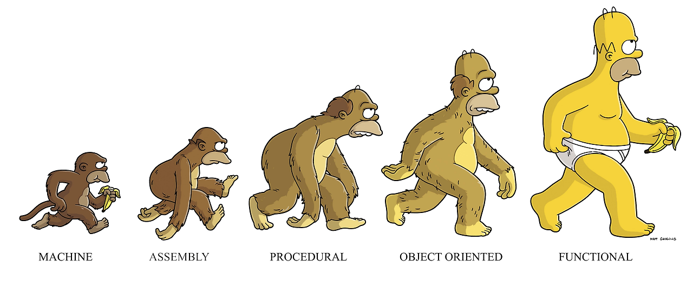
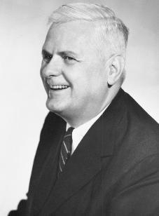
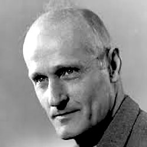
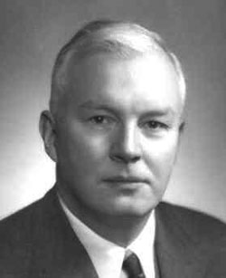
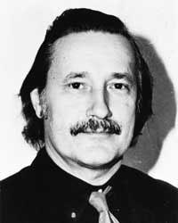

# 람다 스페셜

## 목차

* [람다 그거 먹는건가요?](#람다-그거-먹는건가요)
* [함수형 프로그래밍의 진화](#함수형-프로그래밍의-진화)
* [무엇에 쓰는 물건인고?](#무엇에-쓰는-물건인고)
* [Java 람다 표현식](#Java-람다-표현식)
* [스트림 API와 컬렉션 조작](#스트림-API와-컬렉션-조작)
* [그럼 람다가 짱인가요?](#그럼-람다가-짱인가요)

## 람다 그거 먹는건가요?


### 람다 대수(Lambda Calculus)

* 람다(Lamda, λ)는 그리스어 알파벳의 11번째 글자로, 로마 알파벳의 L에 해당함.
* 람다 대수는 알론조 처치(Alonzo Church)가 1930년대에 제안한 수학적 모델로, 함수와 함수의 적용을 다루는 이론적 체계임.
* 함수를 나타낼때 `λ` 기호를 사용하였기 때문에 람다라는 용어를 사용하게됨
* 람다식(Lambda expression) 또는 람다항(Lamda term)의 문법
  * 변수(Variable): 값을 나타내는 식별자 `$x$`
  * 추상화(Abstraction): 함수를 말함
    * 함수 정의를 나타내는 식.
    * `$λx.M$` 형태로 표현됨. `λ`는 함수의 시작을, `x`는 인자,
      `M`은 함수의 본체(body)를 나타내는 또다른 람다 항이다.
    * 람다 추상화(함수)는 이름이 없다.
      * `$λx.x + 1$`은 Javascript로 `function(x) { return x + 1; }`와 같음
  * 적용(Application): 함수 호출을 말함
    * 함수에 인자를 적용하는 것을 나타내는 식.
    * `$MN$` 형태로 표현됨. 여기서 `$M$`은 함수, `$N$`은 인자
    * 연산 순서는 왼쪽결합으로 `$MNP$`는 `$(MN)P$`와 같음.
    * `$λx.x + 1$`에 `2`를 적용하는 것은 `$λx.x + 1(2)$`로 표현됨.
      * 이는 Javascript로 `(function(x) { return x + 1; })(2)`와 같다.
    * 람다식에서 함수 호출은 함수의 본체에 인자를 전달하는 것을 의미함
      * `$λx.(x + 1) (2)$`는 Javascript로 `(function(x) { return x + 1; })(2)`와 같다.
* 커링(Curring)
  * 람다 함수는 원칙상 인자가 1개뿐이다.
  * `$λ(x,y).x + y$`는 `$λx.λy.x + y$`로 표현되어야 한다.
  * 이렇게 다중 인자를 가진 함수를 하나의 인자를 가진 함수들의 연쇄로 변환하는 것을 커링이라고 한다.
    ```javascript
    (function(a, b) {
        return a + b;
    })(3, 4); // 3 + 4
     
    (function(a) {
        return function(b) {
            return a + b;
        };
    })(3)(4); // 3 + 4
    ```
* 처치-튜링 명제(Church-Turing thesis) 
  * 람다 대수는 모든 계산 가능한 함수를 표현할 수 있음
  * 튜링 완전성(Turing completeness): 튜링 기계(Turing machine)와 동등한 계산 능력을 가짐
* 자유변수(free variable) vs. 속박변수(bound variable)
  * 속박변수(bound variable): 람다 추상화에 정의된 변수(인자로 선언된 변수)
  * 자유변수(free variable): 람다항 내에 나타나지만 해당변수를 속박되지 않은 변수(인자가 아닌 변수)
  * `$λx.x + y$`에서 `x`는 속박변수이고, `y`는 자유변수임
  * 스포일러: 이 구분은 이후 계산 과정에서 중요해짐

### 계산 규칙

* 알파 변환(α-conversion)
  * 람다식의 속박 변수를 다른 변수로 치환해도 함수는 동등하다. 이때 자유변수는 건드리지 않는다.
    * `$λx.x + y$`와 `$λz.z + y$`는 같은 함수임
  * 알파변환의 목적은 다음의 베타 축약을 할때 변수명 충돌을 방지하기 위해 필요한 것임 
* 베타 축약(β-reduction)
  * 함수 적용(application)이 동작하는 원리
  * `$λx.M N$`은 함수 `$λx.M$`에 `$N$`을 인자로 적용하는 것인데
    * 이 과정은 `λ`(꼭지)를 떼고 `$M$`에서 속박변수 `$x$`를 `$N$`으로 치환한 결과와 같다
    ```
    $(λx.x + 3) 2$
    => $2 + 3$
    
    $(λf.λx.f(f x)) (λx.x*2) 3$
    => $(λf.λx.f(f x)) (λy.y*2) 3$     # 알파 치환 (x: = y)
       => $(λx.(λy.y*2)(λy.y*2 x)) 3$
          => $(λy.y*2)(λy.y*2 3)$
             => $(λy.y*2) 6$ 
                => $6 * 2$
                   => 12
      ```
* 에타 변환(η-conversion)
  * 두 함수가 모든 가능한 입력에 대해서 동일한 출력을 낸다면 두 함수는 동등하다.
  * 람다식의 본체가 속박변수에 대한 함수 호출인 경우, 이를 제거할 수 있음
    * `$λx.(M x)$`는 `$M$`과 동등하다.
    * `$λx.x + 1 x$`는 `$x + 1$`과 같다.
      ```javascript
      function(y) {
          return (function(x) { return x + 1; })(y);
      }
      
      function(x) { return x + 1; }  // 두 함수는 같다.
      ```
  * 에타 변환은 람다식을 간결하게 하고 때로 추가적인 베타축약을 가능하게 한다.
  * Java에서는 메소드 참조(Method Reference)라는 개념의 이론적 배경이 된다.
    ```java
    @Test
    public void testLambda() {
        // (int, int) -> int
        BiFunction<Integer, Integer, Integer> f = (a, b) -> Integer.sum(a, b);
        BiFunction<Integer, Integer, Integer> g = Integer::sum;
        // 이론적으로는 동등하지만 실제로는 다르다 ㅋㅋ
        // assertEquals(f, g); 
        assertNotEquals(f, g);
    }
    ```

### 클로저(closure)

```javascript
let plus_a = function(a) {  // $λa.λb.a + b$
    return function(b) {    // 클로저
        return a + b        // a: 자유변수
    }
}

let plus_3 = plus_a(3)  // $(λa.λb.a + b) 3$ => $λb.3 + b$
plus_3(5)               // 8

let plus_4 = plus_a(4)  // $(λa.λb.a + b) 4$ => $λb.4 + b$
plus_4(5)               // 9
```

* 클로저(closure)란 함수와 함수가 정의된 환경이 캡슐화된 객체임
  * `function(b) { return a + b; }`는 `a`라는 자유변수를 가진 클로저
* 클로저 인스턴스(closure instance)
  * 클로저에 자유변수에 대한 정의(`a := 3`)가 적용된 `plus_3`같은 함수
  * 딱히 규정된 이름은 없는 듯 하고, 다양하게 부른다.
    * 특화된 함수 (Specialized Function)
    * 부분 적용된 함수 (Partially Applied Function)
    * 커링된 함수 (Curried Function)
  * `plus_a` 함수의 지역변수인 `a`가 클로저 내에 자유변수로 포획(captured)되었다고 말한다.

> Q: 람다는 그냥 메소드를 인라인으로 쓸 수 있는 것 아닌가요? \
> A: 네 아닙니다. 람다식은 클로저이며 객체로 생각해야 합니다. \
>    포획된 변수를 필드로 하고, 함수의 본체를 메소드로 하는 하나의 객체라고 생각하세요.

#### 변수 포획(Capturing Variables)

* C언어 부터 함수 포인터를 사용할 수 있었고, 함수 포인터를 다른 함수의 인자로 넘길 수도 있지만,
  함수 포인터를 람다식이라고 하지 않음. (C에서는 변수 포획 메커니즘이 구현 불가능함)
* C++에서도 C와 같이 함수 포인터는 가능하지만 그것을 람다라고 하지 않음.
  * C++에서는 별도의 람다식이 지원되며 템플릿 클래스와 같이 취급됨
* Java 에서는 람다식에 변수 포획이 지원되지만 `final` 이나 effectively final 만 가능하다는 제약이 있음
  ```java
  void main() {
      int a = 3;
      Runnable r = () -> {
          System.out.println(a); // a는 자유변수로 포획됨
      };
      a = 4; // 컴파일 에러: 람다식에서 포획된 변수는 final 이나 effectively final 이어야 함
  }
  ```
* `final` 객체 참조를 통한 변경 가능한 변수를 만드는 것은 가능함
  ```java
  class Holder {
      int value;
  }
  void main() {
      final Holder holder = new Holder();
      holder.value = 3; // 변경 가능한 변수
      Runnable r = () -> {
          System.out.println(holder.value); // holder 객체 참조는 자유변수로 포획됨
      };
      holder.value = 4; // holder의 필드는 변경 가능함
  }
  ```

## 함수형 프로그래밍의 진화



### 알론조 처치(Alonzo Church, 1903 ~ 1995)



* 컴퓨터 과학은 아니고 논리 수학자
* 1930년대 람다 대수(Lambda Calculus)를 제안
* 제자들에 의해서 튜링 완전성(Turing completeness)이 증명됨

> 스티븐 클레이니(Stephen Kleene, 1909 ~ 1994)
>
> 
> * 알론조 처치의 제자이자 논리 수학자
> * 재귀 함수론과 람다 대수 사이의 관계를 연구
> * 정규 표현식(regular expression)이라는 용어와 기초가 되는 논리 연산자(`|`, `+`, `*` 등)를 제안

### 하스켈 커리(Haskell Brooks Curry, 1900 ~ 1982)



* 역시 논리 수학자로 함수형 프로그래밍의 이론적 토대를 만듬.
* 커링(Currying)이라는 용어는 이분의 이름에서 따온 것임
* 이름의 모든 부분이 프로그래밍언어의 이름으로 사용되었다.
  * Haskell: 함수형의 대표격으로 언급되는 언어
  * Brooks: 실험적 다중 패러다임 프로그래밍 언어(2003년)
  * Curry: 역시 함수형 언어

> 모시스 쇤핀켈 (Moses Schönfinkel, 1882 ~ 1942)
>
> 
> * 러시아 출신 논리학자로 커링 개념의 원작자
> * 1920년대 다중 인자를 받는 함수를 하나의 인자만 받는 함수들의 연속으로 변환하는 아이디어를 제시

### 1급 시민(First-Class Citizen)

프로그래밍 언어에서 다음 조건을 만족하는 것를 1급 시민이라고 함.

* 변수에 할당될 수 있다.
* 데이터 구조에 저장될 수 있다.
* 함수의 인자로 전달될 수 있다.
* 함수의 반환 값으로 사용될 수 있다.
* 실행 중에 동적으로 생성될 수 있다.

최초로 함수를 1급 시민으로 취급한 언어는 Lisp(LISt Processing) 언어이다.

```lisp
(defun factorial (n)
  (if (<= n 1)
      1
      (* n (factorial (- n 1)))))
```

> 크리스토퍼 스트레이치(Christopher Strachey, 1916 ~ 1975)
>
> 
> * 60년대에 프로그래밍 언어를 연구하며 1급 시민 개념을 최초로 제시
> * Lisp개발에 참여한건 아니고, 이후 C언어의 조상인 CPL(Combined Programming Language)
    >   언어 개발에 참여하심

### ISWIM (If You See What I Mean)

피터 랜딘이 실험적으로 만든 언어로 모든 함수형 언어의 조상에 해당.

```iswim
let fact n =
  where rec f x = if x = 0 then 1 else x * f (x - 1)
  in f n
```

> 피터 랜딘(Peter Landin, 1930 ~ 2009)
>
> 
> * SECD 기계: 람다 대수 표현식을 평가하기 위한 추상 기계. 이는 많은 함수형 언어 인터프리터의 기초가 됨
> * "Syntactic sugar" (문법적 설탕)라는 표현을 대중화 시킴

### Hindley-Milner 타입 추론 알고리즘

* 프로그래머가 명시적으로 타입을 선언하지 않아도 컴파일러가 타입을 추론할 수 있는 알고리즘.
* J. Roger Hindley에 의해서 처음 발견하였고, 로빈 밀러가 (독립적으로?) 다시 발견함

```java
var v = 1; // v는 int 타입으로 추론됨
var f = (x) -> x + 1; // f는 (int) -> int 타입(Function<Integer>)으로 추론됨
```

> 로빈 밀너(Robin Milner, 1934 ~ 2010)
>
> 
> * ML(Meta Language) 함수형 언어 개발 (Standard ML, OCaml, F# 등의 조상)

## 무엇에 쓰는 물건인고?


### 절차적 vs. 선언적

* 거창하게 함수형 프로그래밍이라고 말하면 이해하기 어렵지만,
  하고자 하는 일을 **선언적**으로 기술하는 언어라고 생각하면 쉬움
  * 우리는 SQL을 배울 때 절차적 사고를 버려야 한다고 배웠음
  * 그 외에도 HTML, CSS 등 선언적 언어를 우리는 많이 다루고 있음

### Collection과 Stream API

```sql
SELECT name FROM plant WHERE lifeCycle = @annual
```

* 절차적 구현
  ```java
  @Test
  public void testProcedural() {
      Plant.LifeCycle annual = Plant.LifeCycle.ANNUAL;
  
      for (Plant p : plants) {                // FROM plant
          if (p.lifeCycle() == annual) {      // WHERE lifeCycle = 'annual'
              String name = p.name();         // SELECT name
              System.out.println(name);
          }
      }
  }
  ```

* 함수형 구현
  ```java
  @Test
  public void testLambda() {
  
      Plant.LifeCycle annual = Plant.LifeCycle.ANNUAL;
  
      plants.stream()                                     // FROM plant
              .filter(p -> p.lifeCycle() == annual)       // WHERE lifeCycle = 'annual'
              .map(Plant::name)                           // SELECT name
              .forEach(System.out::println);
  }
  ```

### 콜백 함수를 간단히

* 비동기/동시성 처리(Asynchronous/Concurrent Processing)
  ```java
  void main() {
      // 여러 쓰레드에서 동시에 재배
      try (ExecutorService executor = Executors.newFixedThreadPool(plants.size())) {
          plants.stream()
                  .map(p -> executor.submit(() -> p.grow()))   // Stream<Future<Flower>>
                  .forEach(future -> {
                      try {
                          Flower flower = future.get();
                          System.out.println(flower.color());
                      } catch (InterruptedException | ExecutionException e) {
                          e.printStackTrace();
                      }
                  });
      }
  }
  ```
* 이벤트 리스너
  ```java
  void main() {
      JButton button = new JButton("클릭하세요");
      button.addActionListener(e -> System.out.println("버튼 클릭됨!"));
  }
  ```
* `null`검사
  ```java
  void main() {
      service.getPlantByName("장미").ifPresentOrElse(
          plant -> System.out.println("장미가 있습니다: " + plant.name()),
          () -> System.out.println("장미가 없습니다.")
      );
  }
  ```

## Java 람다 표현식

### 람다 표현식 문법

* 기본 문법: `(parameters ...) -> { statements }`
* 함수 바디가 리턴문만 있는 경우
  * `(parameters ...) -> { return value; }` => `$(parameters ...) -> value`
* 인자가 한개 뿐인 경우
  * `(parameter) -> value` => `parameter -> value`
* 자료형 지정이 가능하나 보통은 타입 추론에 맏긴다.
  * `(String s) -> s.length()` => `s -> s.length()`
* 메소드 참조: 함수 바디가 메소드 호출 하나뿐인 경우
  * `s -> s.length()` => `String::length`
  * `s -> { System.out.println(s); }` => `System.out::println`

### 람다는 객체라고 했는데 어떤 클래스?

* 람다식은 함수형 인터페이스(Functional Interface)라고 불리는 인터페이스를 구현한 익명 클래스의 인스턴스임
* 함수형 인터페이스
  * 함수형 인터페이스 메소드(abstract method)가 한개뿐
  * `@FunctionalInterface` 어노테이션을 사용하여 함수형 인터페이스임을 명시할 수 있음(없어도 됨)
  * 메소드의 이름은 람다에서는 상관없고, 직접 코드로 호출하는 경우 적절한 이름으로 하면 된다.

```java
@FunctionalInterface
interface Operation<T> {
    T apply(T a, T b);
}

enum Operator {
    ADD("+", (a, b) -> a + b),
    SUBTRACT("-", (a, b) -> a - b),
    MULTIPLY("*", (a, b) -> a * b),
    DIVIDE("/", (a, b) -> a / b);

    private final String symbol;
    private final Operation<Integer> operation;

    Operator(String symbol, Operation<Integer> operation) {
        this.symbol = symbol;
        this.operation = operation;
    }
    public String symbol() { return symbol; }
    public Operation<Integer> operation() { return operation; }
}
```

### 내장 함수 인터페이스

* 함수형 인터페이스는 C언어의 함수 포인터 선언과 비슷하다고 생각하면 됨

```c
#include <stdio.h>

typedef int (*Operator)(int, int);

int add(int, int);

void main() {
    Operator plus = add;
    printf("%d + %d = %d\n", 3, 4, plus(3, 4));
}

int add(int a, int b) {
    return a + b;
}
```

* 그런데 함수의 기능과 이름은 다양할 수 있지만 많이 사용하는 함수의 시그니처는 거기서 거기인 경우가 많음
* 그래서 많이 사용되는 함수 시그니처가 `java.util.function` 패키지에 미리 정의되어있음.

| 시그니처                | 이름                    | 메소드                      | 예                     |
|---------------------|-----------------------|--------------------------|-----------------------|
| `(T) -> T`          | `UnaryOperator<T>`    | `T apply(T t)`           | `String::toLowerCase` |
| `(T, T) -> T`       | `BinaryOperator<T>`   | `T apply(T t1, T t2)`    | `BigInteger::add`     |
| `(T) -> boolean`    | `Predicate<T>`        | `boolean test(T t)`      | `Collection::isEmpty` |
| `(T) -> R`          | `Function<T, R>`      | `R apply(T t)`           | `Arrays::asList`      |
| `() -> T`           | `Supplier<T>`         | `T get()`                | `Instant::now`        |
| `(T) -> void`       | `Consumer<T>`         | `void accept(T t)`       | `System.out::println` |

* 기본 자료형 변형

| 기본형                 | 시그니처                  | 이름                     | 메소드                               |
|---------------------|-----------------------|------------------------|-----------------------------------|
| `UnaryOperator<T>`  | `(long) -> long`      | `LongUnaryOperator`    | `long apply(long v)`              |
|                     | `(int) -> int`        | `IntUnaryOperator`     | `int apply(int v)`                |
|                     | `(double) -> double`  | `DoubleUnaryOperator`  | `double apply(double v)`          |
| `BinaryOperator<T>` | `(long) -> long`      | `LongBinaryOperator`   | `long apply(long v1, long v2)`    |
|                     | `(int) -> int`        | `IntBinaryOperator`    | `int apply(int v1, int v2)`       |
|                     | `(double) -> double`  | `DoubleBinaryOperator` | `double apply(double v1, int v2)` |
| `Predicate<T>`      | `(long) -> boolean`   | `LongPredicate`        | `boolean test(long v)`            |
|                     | `(int) -> boolean`    | `IntPredicate`         | `boolean test(int v)`             |
|                     | `(double) -> boolean` | `DoublePredicate`      | `boolean test(double v)`          |
| `Function<T, R>`    | `(long) -> int`       | `LongToIntFunction`    | `int apply(long v)`               |
|                     | `(long) -> double`    | `LongToDoubleFunction` | `double apply(long v)`            |
|                     | `(int) -> long`       | `IntToLongFunction`    | `long apply(int v)`               |
|                     | `(int) -> double`     | `IntToDoubleFunction`  | `double apply(int v)`             |
|                     | `(double) -> long`    | `DoubleToLongFunction` | `long apply(double v)`            |
|                     | `(double) -> int`     | `DoubleToIntFunction`  | `int apply(double v)`             |
|                     | `(T) -> long`         | `ToLongFunction<T>`    | `long apply(T t)`                 |
|                     | `(T) -> int`          | `ToIntFunction<T>`     | `int apply(T t)`                  |
|                     | `(T) -> double`       | `ToDoubleFunction<T>`  | `double apply(T t)`               |
| `Supplier<T>`       | `() -> long`          | `LongSupplier`         | `long get()`                      |
|                     | `() -> int`           | `IntSupplier`          | `int get()`                       |
|                     | `() -> double`        | `DoubleSupplier`       | `double get()`                    |
|                     | `() -> boolean`       | `BooleanSupplier`      | `boolean get()`                   |
| `Consumer<T>`       | `(long) -> void`      | `LongConsumer`         | `void accept(long v)`             |
|                     | `(int) -> void`       | `IntConsumer`          | `void accept(int v)`              |
|                     | `(double) -> void`    | `DoubleConsumer`       | `void accept(double v)`           |

* 인수 개수 변형

| 기본형              | 시그니처                  | 이름                         | 메소드                          |
|------------------|-----------------------|----------------------------|------------------------------|
| `Predicate<T>`   | `(T, U) -> boolean`   | `BiPredicate<T, U>`        | `boolean test(T t, U u)`     |
| `Function<T, R>` | `(T, U) -> R`         | `BiFunction<T, U, R>`      | `R apply(T t, U u)`          |
|                  | `(T, U) -> long`      | `ToLongBiFunction<T, U>`   | `long apply(T t, U u)`       |
|                  | `(T, U) -> int`       | `ToIntBiFunction<T, U>`    | `int apply(T t, U u)`        |
|                  | `(T, U) -> double`    | `ToDoubleBiFunction<T, U>` | `double apply(T t, U u)`     |
| `Consumer<T>`    | `(T, U) -> void`      | `BiConsumer<T, U>`         | `void accept(T t, U u)`      |
|                  | `(T, long) -> void`   | `ObjLongConsumer<T>`       | `void accept(T t, long v)`   |
|                  | `(T, int) -> void`    | `ObjIntConsumer<T>`        | `void accept(T t, int v)`    |
|                  | `(T, double) -> void` | `ObjDoubleConsumer<T>`     | `void accept(T t, double v)` |

## 스트림 API와 컬렉션 조작

### 스트림 연산

TODO: 준비중

## 그럼 람다가 짱인가요?


### QuickSort 성능 비교

테스트 비교군 정의

* Java
  * `array`: `int[]` 사용 절차적 프로그램
  * `list`: `List<Integer>` 사용 절차적 프로그램 
  * `lambda`: `List<Integer>.stream()` 사용 함수형 프로그램
* Kotlin
  * `array`: `IntArray` 사용 절차적 프로그램
  * `list`: `List<Int>` 사용 절차적 프로그램
  * `lambda`: `List<Int>` 사용 함수형 프로그램

> 단위: `java array` 대비 비율

| lang | method | 3 | 10 | 100 | 1k | 10k | 100k | 1M |
|------|--------|---|----|-----|----|-----|------|----|
| java | array | 1.0 | 1.0 | 1.0 | 1.0 | 1.0 | 1.0 | 1.0 |
| java | list | 2.1 | 3.5 | 4.1 | 2.7 | 3.3 | 2.7 | 4.3 |
| java | lambda | 22.4 | 55.6 | 31.3 | 22.2 | 33.0 | 20.0 | 13.0 |
| kotlin | array | 2579.4 | 0.8 | 0.8 | 1.2 | 1.2 | 1.0 | 1.0 |
| kotlin | list | 998.7 | 2.2 | 2.2 | 2.6 | 3.2 | 2.6 | 4.3 |
| kotlin | lambda | 1642.3 | 24.1 | 14.0 | 14.3 | 14.9 | 13.5 | 10.9 |

<details>
<summary>ms 단위 보기</summary>

| lang | method | 3 | 10 | 100 | 1k | 10k | 100k | 1M |
|------|--------|---|----|-----|----|-----|------|----|
| java | array | 0.005 | 0.005 | 0.050 | 0.323 | 0.993 | 5.998 | 72.889 |
| java | list | 0.010 | 0.017 | 0.206 | 0.858 | 3.272 | 16.096 | 315.650 |
| java | lambda | 0.110 | 0.278 | 1.568 | 7.166 | 32.749 | 119.956 | 946.153 |
| kotlin | array | 12.639 | 0.004 | 0.039 | 0.374 | 1.231 | 5.893 | 71.227 |
| kotlin | list | 4.894 | 0.011 | 0.109 | 0.847 | 3.209 | 15.866 | 316.333 |
| kotlin | lambda | 8.047 | 0.121 | 0.702 | 4.631 | 14.806 | 81.056 | 792.388 |

</details>

* 일반적인 성능에 대한 커뮤니티 의견(Kotlin >= Java)이 맞는 것으로 보임
* Kotlin 3건 대상의 경우 매우 느린데, Java에서 Kotlin 코드 실행시 초기화 작업(jit 컴파일 같은)이 필요한 것으로 보임
* 반대로 Kotlin에서 Java 코드 실행시에는 훨씬 덜한 것으로 보이며 `java lamda`에서만 발생함.
  <details>
    <summary>숫자 보기</summary>

    > 테스트 실행시마다 랜덤수로 배열을 생성하므로 java에서 실행한 결과와 1:1 비교는 불가능함

    | lang | method | 3 | 10 | 100 | 1k | 10k | 100k | 1M |
    |------|--------|---|----|-----|----|-----|------|----|
    | java | array | 1.0 | 1.0 | 1.0 | 1.0 | 1.0 | 1.0 | 1.0 |
    | java | list | 2.9 | 3.3 | 3.3 | 2.1 | 2.8 | 2.6 | 4.2 |
    | java | lambda | 227.6 | 55.2 | 34.1 | 21.7 | 24.7 | 19.1 | 13.7 |
    | kotlin | array | 0.7 | 0.9 | 0.7 | 0.9 | 1.0 | 1.0 | 1.0 |
    | kotlin | list | 1.7 | 3.1 | 1.8 | 2.1 | 2.7 | 3.1 | 4.2 |
    | kotlin | lambda | 7.2 | 23.5 | 10.6 | 11.4 | 12.0 | 10.6 | 11.0 |
    
    | lang | method | 3 | 10 | 100 | 1k | 10k | 100k | 1M |
    |------|--------|---|----|-----|----|-----|------|----|
    | java | array | 0.006 | 0.003 | 0.060 | 0.325 | 1.183 | 5.947 | 69.891 |
    | java | list | 0.018 | 0.011 | 0.199 | 0.670 | 3.288 | 15.225 | 294.623 |
    | java | lambda | 1.389 | 0.177 | 2.030 | 7.040 | 29.266 | 113.410 | 958.802 |
    | kotlin | array | 0.004 | 0.003 | 0.043 | 0.306 | 1.156 | 6.237 | 69.246 |
    | kotlin | list | 0.010 | 0.010 | 0.106 | 0.672 | 3.147 | 18.153 | 295.639 |
    | kotlin | lambda | 0.044 | 0.075 | 0.630 | 3.710 | 14.202 | 63.236 | 770.101 |

  </details>

### 꼬리 호출 최적화(Tail Call Optimization)

* 꼬리 호출(Tail Call)
  * 함수의 마지막 문장이 다른 함수를 호출하는 경우를 말함.
  * 꼬리 호출인 경우
    ```javascript
    function foo(n) {
      // ... 어떤 연산 ...
      return bar(n - 1); // bar의 결과가 foo의 최종 결과가 됨
    }
    ```
  * 꼬리 호출이 아닌 경우
    ```javascript
    function baz(n) {
        // ... 어떤 연산 ...
        return 1 + qux(n - 1); // qux 호출 후 덧셈 연산이 추가로 있음
    }
    ```
* 꼬리 호출 최적화(TCO, Tail Call Optimization)
  * 꼬리 호출인 경우 새로운 콜 스택 프레임을 얹는 것이 아니라 현재 스택 프레임을 덮어쓰도록 함
  * 재귀호출 등으로 콜 스택이 많이 쌓여도 스택 오버플로우(Stack Overflow) 위험이 줄어든다.
  * 함수형 프로그래밍 언어(Lisp, Scheme, Haskell, Scala, Erlang)들은 언어 차원에서 지원
  * JavaScript, Scala, Kotlin 등에서도 부분적으로 지원한다.
* Java의 경우 TCO를 지원하지 않음
  * 이는 Java의 콜 스택이 언어의 다른 메커니즘들과 깊은 관련이 있기 때문이다.
    (예외 처리 Stack trace, `SecurityManager.checkMemberAccess()` 등 보안 관련 기능)
  * Java는 TCO는 지원하지 않지만 가상 스레드(Virtual Threads)를 통해서 스택 오버플로우 위험을 줄일 수 있음(Java 21)
  * Scala, Kotlin은 Java와 같은 JVM에서 실행되지만 TCO를 지원하는데,
    컴파일러 수준에서 지원하는 것이고 함수형 언어들과 같은 본격적인 지원은 아니다.
    * 예를들어 Kotlin의 경우 기본적으로 TCO를 지원하지 않지만, `tailrec` 키워드를 사용하여
      컴파일러가 꼬리 호출을 반복문처럼 바꾸어 컴파일 한다.

### 결론

* Stream API와 람다식을 이용하여 가독성을 높이고 코드의 복잡성을 줄이는 것은 좋다.
* 하지만 함수형 프로그래밍에 심취하여 알고리즘을 함수형으로 구현하는 개발자가 있다면 혼쭐 내주자.
* 그래도 람다식이 눈에 안들어온다면 성능과 짬밥을 무기로 찍어 누르자.

## 준비중

### 데이터 테이블 예제

* STUDENT

|   S_NO   | NAME | ADDRESS |
|:--------:|:----:|:-------:|
| 20231001 | 홍길동  |   강남구   |
| 20231002 | 이순신  |   종로구   |
| 20231003 | 강감찬  |   서초구   |
| 20231004 | 유관순  |   마포구   |

* CLASS

|   C_NO   | CLASS_NAME | TEACHER |
|:--------:|:---------:|:-------:|
| 20231001 |   수학    |   김철수  |
| 20231002 |   과학    |   이영희  |
| 20231003 |   영어    |   박영수  |

* STUDENT_CLASS

|   S_NO   |   C_NO   |
|:--------:|:-------:|
| 20231001 | 20231001 |
| 20231002 | 20231002 |
| 20231003 | 20231001 |
| 20231004 | 20231003 |


```sql
SELECT S.S_NO, S.NAME, S.ADDRESS, C.CLASS_NAME, C.TEACHER
FROM STUDENT S,
     STUDENT_CLASS SC,
     CLASS C
WHERE S.S_NO = SC.S_NO
  AND SC.C_NO = C.C_NO
  AND S.NAME = '홍길동';
```
